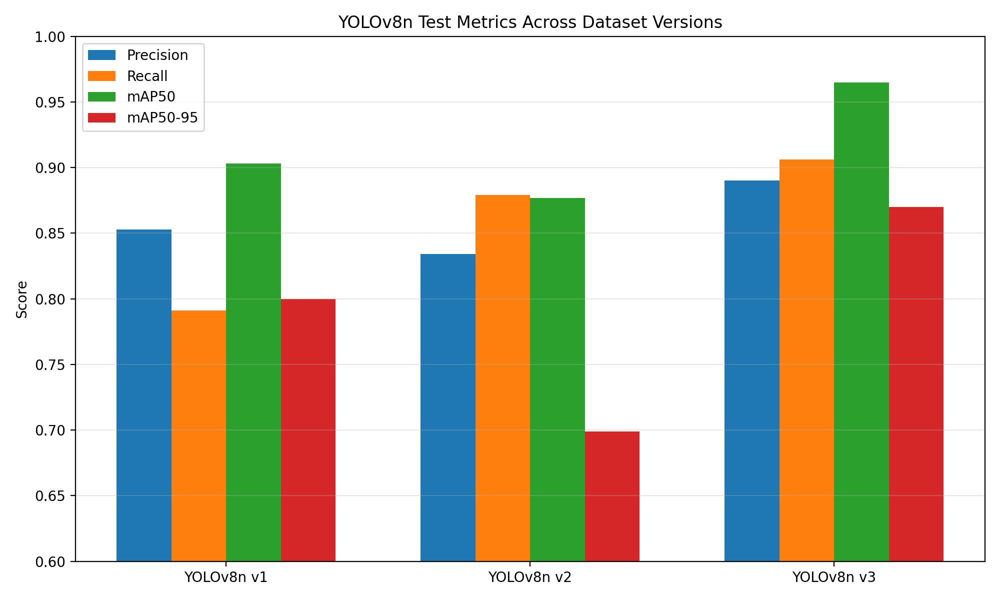
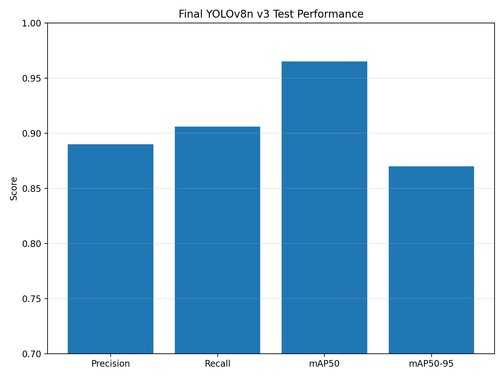
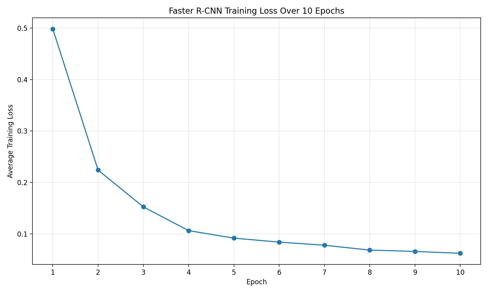
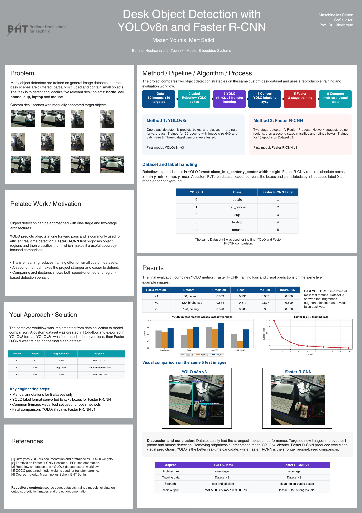

# Desk Object Detection with YOLOv8 and Faster R-CNN

Mazen Younis  
Mert Satici

# Table of Contents

- [Project Description](#project-description)
- [Project Goals](#project-goals)
- [Dataset](#dataset)
  - [Image Collection](#image-collection)
  - [Target Classes](#target-classes)
  - [Annotation](#annotation)
  - [Dataset Versions](#dataset-versions)
- [Development Environment](#development-environment)
- [Method 1: YOLOv8n](#method-1-yolov8n)
  - [Baseline Test](#baseline-test)
  - [Fine-Tuning](#fine-tuning)
  - [YOLO Dataset Versions](#yolo-dataset-versions)
- [Method 2: Faster R-CNN](#method-2-faster-r-cnn)
  - [Reason for Choosing Faster R-CNN](#reason-for-choosing-faster-r-cnn)
  - [YOLO Label Conversion](#yolo-label-conversion)
  - [Training Setup](#training-setup)
- [Results](#results)
  - [Result Graphs](#result-graphs)
  - [YOLOv8n Results](#yolov8n-results)
  - [Faster R-CNN Results](#faster-r-cnn-results)
  - [Visual Results](#visual-results)
- [Comparison and Discussion](#comparison-and-discussion)
- [Conclusion](#conclusion)
- [Project Structure](#project-structure)
- [How to Run](#how-to-run)
- [Final Model Outputs](#final-model-outputs)

# Project Description

This project implements an object detection system for everyday objects in desk scenes. The goal is to detect and localize selected objects that commonly appear in a working or study environment.

The project focuses on five object classes:

- `bottle`
- `cell_phone`
- `cup`
- `laptop`
- `mouse`

Two different object detection methods were implemented and compared:

1. **YOLOv8n**, a one-stage object detector that performs detection efficiently in a single forward pass.
2. **Faster R-CNN**, a two-stage object detector that first proposes object regions and then classifies them.

The complete workflow was implemented in this project. It includes image collection, manual annotation, dataset export, model training, model evaluation, visual prediction tests and a comparison between both methods.

# Project Goals

The main goals of the project were:

- Create a custom dataset of real desk scenes.
- Annotate the dataset manually using bounding boxes.
- Train a YOLOv8n model using transfer learning.
- Improve the YOLO model through several dataset versions.
- Implement a second object detection method using Faster R-CNN.
- Compare YOLOv8n and Faster R-CNN on the same object detection task.
- Evaluate the models using quantitative metrics and visual prediction examples.
- Document the complete workflow in a clear and reproducible way.

# Dataset

## Image Collection

A custom image dataset was created for this project. The images show real desk environments with different everyday objects placed on or near a desk. The dataset was created using own photos and additional photos from the second project member.

The first dataset version contained 80 images:

| Source | Number of Images |
|---|---:|
| Own image collection | 48 |
| Second image collection | 32 |
| Total | 80 |

After the first training experiments, additional images were collected. These new images focused especially on the weaker classes from the first model version, mainly `cell_phone` and `mouse`.

The final dataset version used for the main comparison contains 120 source images.

## Target Classes

Five target classes were defined for the project.

| Class ID | YOLO Class Name | Faster R-CNN Label |
|---:|---|---:|
| 0 | `bottle` | 1 |
| 1 | `cell_phone` | 2 |
| 2 | `cup` | 3 |
| 3 | `laptop` | 4 |
| 4 | `mouse` | 5 |

For Faster R-CNN, the class IDs were shifted by `+1` because label `0` is reserved for the background class.

Objects such as keyboard, monitor, desk, cable, screen or mousepad were not defined as target classes and were therefore not annotated.

## Annotation

The dataset was annotated manually in Roboflow. Each relevant object was marked with a bounding box and assigned to one of the five target classes.

The annotation process followed these rules:

- Annotate only the five selected classes.
- Draw bounding boxes as closely as possible around the visible object area.
- Annotate partially visible objects only if they are still clearly recognizable.
- Do not annotate non-target objects such as keyboard, monitor, desk, cable, screen or mousepad.

The dataset was exported from Roboflow in YOLOv8 format.

## Dataset Versions

Three dataset versions were created during the project.

| Version | Source Images | Augmentation | Purpose |
|---|---:|---|---|
| Dataset v1 | 80 | None | First fine-tuning dataset |
| Dataset v2 | 120 | Brightness augmentation | Targeted improvement for `cell_phone` and `mouse` |
| Dataset v3 | 120 | None | Cleaner final dataset without augmentation |

Dataset v1 was used for the first fine-tuning run. It already produced useful results, but smaller or darker objects such as `cell_phone` and `mouse` were less stable.

Dataset v2 added 40 targeted images and used brightness augmentation. This improved recall but produced too many false positive detections in the visual tests, especially for the class `cell_phone`.

Dataset v3 used the same 120 source images as Dataset v2 but without brightness augmentation. This version produced the best YOLO results and was therefore used as the final dataset for comparing YOLOv8n and Faster R-CNN.

# Development Environment

The project was implemented locally in Python.

Main tools and libraries:

- Python 3.12
- PyTorch
- Torchvision
- Ultralytics YOLOv8
- OpenCV
- PIL
- NumPy
- Matplotlib
- Roboflow for annotation and dataset export

The project was developed and executed locally on an Apple M4 system using CPU training.

# Method 1: YOLOv8n

YOLOv8n was used as the first object detection method. YOLO is a one-stage detector, which means that it predicts bounding boxes and class probabilities in a single forward pass.

This makes YOLO suitable for efficient object detection and potential real-time applications.

## Baseline Test

At the beginning of the project, a pretrained YOLOv8n model was tested without custom training. This baseline test used five example desk images from:

```text
data/test_images/
```

The baseline model was able to detect some relevant objects, but it also predicted classes that were not part of the project, such as `keyboard` or `dining table`.

This showed that the pretrained model already had general object detection knowledge, but it was not specialized for the selected desk object classes.

The baseline scripts are:

```text
src/detect_baseline.py
src/detect_raw_baseline.py
```

## Fine-Tuning

The YOLOv8n model was fine-tuned on the custom dataset using transfer learning. The pretrained model `yolov8n.pt` was used as the starting point.

The main training configuration was:

| Parameter | Value |
|---|---|
| Model | YOLOv8n |
| Pretrained weights | `yolov8n.pt` |
| Image size | 640 |
| Batch size | 8 |
| Epochs | 50 |
| Training device | CPU, Apple M4 |

The training script is located at:

```text
src/train_yolo.py
```

The final YOLO model version is saved under:

```text
results/fine_tuned/yolov8n_desk_objects_v3/
```

## YOLO Dataset Versions

Several YOLO training runs were performed.

### YOLOv8n v1

The first model was trained on Dataset v1 with 80 images. It produced good initial results, but some classes, especially `cell_phone` and `mouse`, were less stable.

### YOLOv8n v2

The second model was trained on Dataset v2 with 120 source images and brightness augmentation. This version improved recall, but visual testing showed that it produced too many false positives. The model started detecting several dark or rectangular regions as `cell_phone`.

### YOLOv8n v3

The third model was trained on Dataset v3 with 120 source images and no augmentation. This version produced the best overall YOLO results and much cleaner visual predictions.

# Method 2: Faster R-CNN

Faster R-CNN was implemented as the second object detection method. It was selected because it is methodologically different from YOLO.

Unlike YOLO, Faster R-CNN is a two-stage detector:

1. A Region Proposal Network proposes possible object regions.
2. A second stage classifies these regions and refines the bounding boxes.

This makes Faster R-CNN a useful comparison method because it follows a different detection strategy.

## Reason for Choosing Faster R-CNN

To strengthen the project and evaluate the task from a second methodological perspective, Faster R-CNN was implemented in addition to YOLOv8n. It was chosen because it is a well-known two-stage object detection architecture and provides a clear contrast to YOLO’s one-stage detection approach.

YOLO is optimized for speed and detects objects in one stage. Faster R-CNN uses a more complex two-stage approach and is often used as a strong region-based detection method.

Therefore, the comparison is meaningful from an engineering perspective:

| Model | Detection Type | Main Characteristic |
|---|---|---|
| YOLOv8n | One-stage detector | Fast and efficient |
| Faster R-CNN | Two-stage detector | Region-based and accuracy-focused |

## YOLO Label Conversion

The dataset was exported in YOLO format. YOLO labels use normalized bounding boxes:

```text
class_id x_center y_center width height
```

Faster R-CNN requires absolute bounding boxes in this format:

```text
x_min y_min x_max y_max
```

Therefore, a custom PyTorch dataset loader was implemented in:

```text
src/train_faster_rcnn.py
```

The loader reads each image and its corresponding YOLO label file, converts the labels to Faster R-CNN format and shifts the class labels by `+1` because Faster R-CNN reserves label `0` for background.

A small test script was also created to verify this conversion:

```text
src/test_faster_rcnn_dataset.py
```

Example conversion result:

```text
Image size: 640 x 640
Class: bottle | Box xyxy: [155.75, 113.0, 288.25, 456.0]
Class: cup    | Box xyxy: [364.75, 357.5, 584.25, 532.5]
```

## Training Setup

The Faster R-CNN model was created using Torchvision. A pretrained `fasterrcnn_resnet50_fpn` model was loaded and the prediction head was replaced to match the six output classes:

- background
- bottle
- cell_phone
- cup
- laptop
- mouse

The Faster R-CNN model was trained on Dataset v3 for 10 epochs.

Training script:

```text
src/train_faster_rcnn.py
```

Saved model:

```text
results/faster_rcnn/faster_rcnn_desk_objects_v1.pth
```

Prediction script:

```text
src/detect_faster_rcnn.py
```

# Results

## YOLOv8n Results

The best YOLO model was YOLOv8n v3. It was trained on Dataset v3 with 120 source images and no augmentation.

### YOLOv8n v3 Validation Results

| Metric | Value |
|---|---:|
| Precision | 0.911 |
| Recall | 0.814 |
| mAP50 | 0.942 |
| mAP50-95 | 0.865 |

### YOLOv8n v3 Test Results

| Metric | Value |
|---|---:|
| Precision | 0.890 |
| Recall | 0.906 |
| mAP50 | 0.965 |
| mAP50-95 | 0.870 |

### YOLO Version Comparison on Test Set

| Version | Dataset | Precision | Recall | mAP50 | mAP50-95 |
|---|---|---:|---:|---:|---:|
| YOLOv8n v1 | 80 images, no augmentation | 0.853 | 0.791 | 0.903 | 0.800 |
| YOLOv8n v2 | 120 images, brightness augmentation | 0.834 | 0.879 | 0.877 | 0.699 |
| YOLOv8n v3 | 120 images, no augmentation | 0.890 | 0.906 | 0.965 | 0.870 |

The results show that Dataset v3 produced the strongest YOLO model. Compared to v1, it improved all main test metrics. Compared to v2, it reduced the false positives that appeared after brightness augmentation.

## Result Graphs

The following graphs visualize the most important quantitative results of the project.

### YOLOv8n Test Metrics Across Dataset Versions

This graph compares the test performance of the three YOLOv8n versions. Dataset v3 achieved the best overall result, especially for `Recall`, `mAP50` and `mAP50-95`.



### Final YOLOv8n v3 Test Performance

This graph summarizes the final test performance of the best YOLO model.




## Faster R-CNN Results

Faster R-CNN was trained on Dataset v3 for 10 epochs.

The average training loss decreased clearly during training:

| Epoch | Average Loss |
|---|---:|
| 1 | 0.4982 |
| 2 | 0.2240 |
| 3 | 0.1524 |
| 4 | 0.1063 |
| 5 | 0.0917 |
| 6 | 0.0840 |
| 7 | 0.0779 |
| 8 | 0.0685 |
| 9 | 0.0659 |
| 10 | 0.0622 |

The decreasing loss indicates that the model learned from the training data.

### Faster R-CNN Training Loss

This graph shows the average training loss of Faster R-CNN over 10 epochs. The loss decreased from `0.4982` in epoch 1 to `0.0622` in epoch 10, which indicates that the model learned the object detection task during training.




After training, Faster R-CNN was tested visually on the same five example images used for the YOLO visual comparison. The visual predictions were clean overall and detected the main target objects with high confidence.

## Visual Results

Both final models were tested on the same five desk images from:

```text
data/test_images/
```

YOLOv8n v3 prediction results are saved in:

```text
results/fine_tuned/predictions_on_test_images_v3/
```

Faster R-CNN prediction results are saved in:

```text
results/faster_rcnn/predictions_on_test_images_v1/
```

The YOLOv8n v3 visual results were strong and much cleaner than YOLOv8n v2. The model detected relevant objects such as `laptop`, `bottle`, `cup`, `cell_phone` and `mouse` with good confidence.

The Faster R-CNN visual predictions were also very clean. It detected the main desk objects with high confidence and produced strong bounding boxes on the example images.

# Comparison and Discussion

The project showed that dataset quality had a strong influence on model performance.

The first YOLO model trained on 80 images already achieved useful results, but some smaller or darker objects were less stable. This was especially visible for `cell_phone` and `mouse`.

To improve these classes, 40 additional targeted images were collected. Dataset v2 used these 120 images together with brightness augmentation. Although this improved recall, visual testing showed many false positives. The model started detecting too many rectangular or dark regions as `cell_phone`.

Dataset v3 used the same 120 source images but removed the brightness augmentation. This produced the best YOLO result. The test metrics improved and the visual predictions became much cleaner.

Faster R-CNN was then implemented as a second method. It used the same Dataset v3 and produced clean visual detections after 10 epochs of training. This confirms that the dataset can be used successfully with different object detection architectures.

The comparison between both methods is useful because YOLOv8n and Faster R-CNN follow different detection strategies.

| Aspect | YOLOv8n v3 | Faster R-CNN v1 |
|---|---|---|
| Detection type | One-stage detector | Two-stage detector |
| Dataset | Dataset v3 | Dataset v3 |
| Training images | 96 | 96 |
| Validation images | 16 | 16 |
| Test images | 8 | 8 |
| Main advantage | Fast and efficient | Clean region-based detections |
| Visual result | Strong and clean | Very clean |
| Expected speed | Faster | Slower |
| Best use case | Efficient or real-time detection | Accuracy-focused comparison |

YOLOv8n v3 achieved strong quantitative results and is expected to be faster during inference. Faster R-CNN showed very clean visual predictions and provided a meaningful second method for comparison.

# Conclusion

The project successfully implemented a complete object detection workflow for real desk scenes.

A custom dataset was collected, annotated and exported in YOLOv8 format. YOLOv8n was first tested as a pretrained baseline and then fine-tuned on multiple dataset versions. The best YOLO model was trained on Dataset v3 with 120 source images and no augmentation.

A second object detection method, Faster R-CNN, was then implemented using PyTorch and Torchvision. Since the dataset was exported in YOLO format, a custom dataset loader was developed to convert YOLO labels into the bounding box format required by Faster R-CNN.

The final comparison showed that both methods can detect the selected desk objects successfully. YOLOv8n v3 achieved strong quantitative results and is suitable for efficient detection, while Faster R-CNN produced very clean visual predictions and provided a meaningful second method for comparison.

Overall, the project goal was achieved. The system can detect the five selected desk objects in real scenes, and the project demonstrates the full process from dataset creation to training, evaluation and model comparison.


# Project Poster

An A1 project poster was created to summarize the complete workflow, methods, results and discussion of the project.

The poster includes:

- the problem and motivation,
- the custom dataset and annotation process,
- the YOLOv8n training workflow with Dataset v1, v2 and v3,
- the Faster R-CNN implementation and training process,
- quantitative result tables,
- generated result graphs,
- visual prediction examples,
- a final comparison and conclusion.



The full poster PDF can be found here:

[Open A1 Project Poster PDF](./docs/poster/MS_Desk_Object_Detection_A1_Vertical_Poster.pdf)

# Project Structure

```text
desk-object-detection-yolo/
├── data/
│   ├── raw/
│   ├── raw_mert/
│   ├── test_images/
│   └── processed/
│       ├── desk_object_detection_v1/
│       ├── desk_object_detection_v2/
│       └── desk_object_detection_v3/
├── docs/
│   ├── images/
│   │   ├── yolo_test_metrics_versions.png
│   │   ├── final_yolov8n_v3_test_performance.png
│   │   └── faster_rcnn_training_loss.png
│   ├── baseline_observations.md
│   ├── dataset_plan.md
│   ├── project_log.md
│   └── training_results.md
├── results/
│   ├── baseline/
│   ├── comparison/
│   ├── evaluation/
│   ├── fine_tuned/
│   └── faster_rcnn/
├── src/
│   ├── detect_baseline.py
│   ├── detect_raw_baseline.py
│   ├── train_yolo.py
│   ├── evaluate_model.py
│   ├── detect_fine_tuned.py
│   ├── compare_models.py
│   ├── generate_result_graphs.py
│   ├── test_faster_rcnn_dataset.py
│   ├── train_faster_rcnn.py
│   └── detect_faster_rcnn.py
├── requirements.txt
├── README.md
└── yolov8n.pt
```

# How to Run

## 1. Install Requirements

Create and activate a virtual environment, then install the required packages:

```bash
pip install -r requirements.txt
```

## 2. Run the YOLO Baseline

```bash
python src/detect_baseline.py
```

The baseline results are saved under:

```text
results/baseline/
```

## 3. Train YOLOv8n

```bash
python src/train_yolo.py
```

The final YOLOv8n v3 model is saved under:

```text
results/fine_tuned/yolov8n_desk_objects_v3/
```

## 4. Evaluate YOLOv8n

```bash
python src/evaluate_model.py
```

The evaluation results are saved under:

```text
results/evaluation/test_set_evaluation_v3/
```

## 5. Run YOLOv8n Predictions on Example Images

```bash
python src/detect_fine_tuned.py
```

The prediction images are saved under:

```text
results/fine_tuned/predictions_on_test_images_v3/
```

## 6. Test Faster R-CNN Dataset Conversion

```bash
python src/test_faster_rcnn_dataset.py
```

This checks whether YOLO labels are correctly converted to Faster R-CNN bounding boxes.

## 7. Train Faster R-CNN

```bash
python src/train_faster_rcnn.py
```

The trained Faster R-CNN model is saved under:

```text
results/faster_rcnn/faster_rcnn_desk_objects_v1.pth
```

## 8. Run Faster R-CNN Predictions on Example Images

```bash
python src/detect_faster_rcnn.py
```

The prediction images are saved under:

```text
results/faster_rcnn/predictions_on_test_images_v1/
```
## 9. Generate Result Graphs

```bash
python src/generate_result_graphs.py
```
This script creates the result graphs used in the README and saves them under:

```text
docs/images/
```

# Final Model Outputs

Final YOLO model:

```text
results/fine_tuned/yolov8n_desk_objects_v3/weights/best.pt
```

Final Faster R-CNN model:

```text
results/faster_rcnn/faster_rcnn_desk_objects_v1.pth
```

Final YOLO visual predictions:

```text
results/fine_tuned/predictions_on_test_images_v3/
```

Final Faster R-CNN visual predictions:

```text
results/faster_rcnn/predictions_on_test_images_v1/
```
